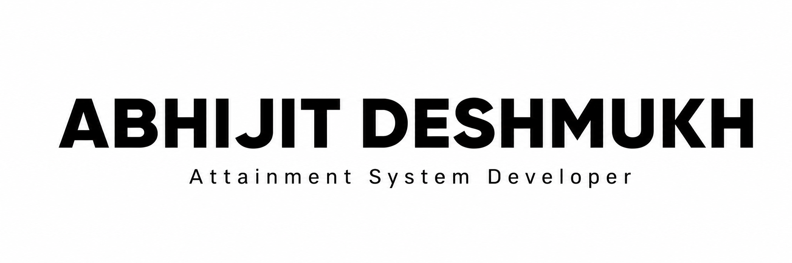
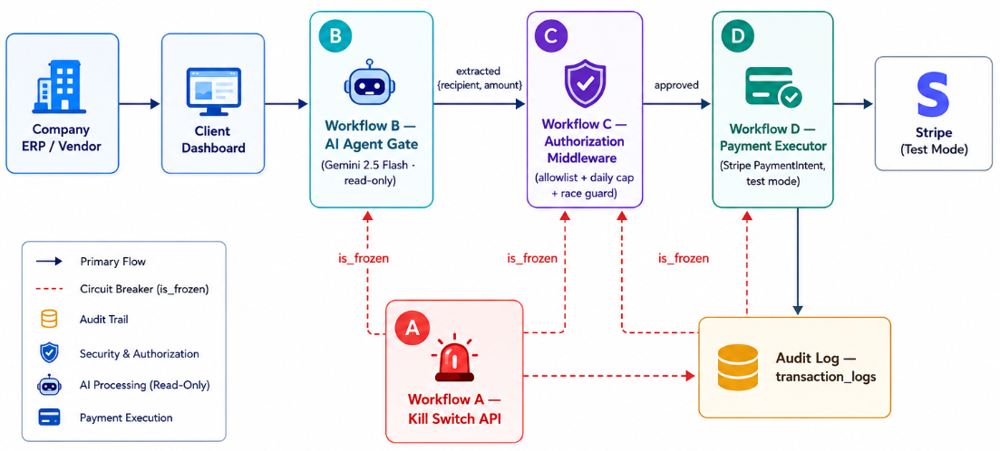

<picture><source media="(prefers-color-scheme: dark)" srcset="./Abhijit.png">
<source media="(prefers-color-scheme: light)" srcset="./Abhijit2.png">
</picture>

 

### AI-Driven Software Developer · SGRAMX Intern · Computer Engineer

 

  
  
  

  
  

  <strong>📍 PIMPRI, PUNE, MAHARASHTRA, INDIA</strong>

 

  <strong><em>“I’m not here to clone tutorials or collect green squares. 
  I find real problems, engineer real solutions, and ship them where they actually matter.”</em></strong>

 

## Tech Stack

<table>
<tr>
<th align="left">Category</th>
<th align="left">Technologies</th>
</tr>

<tr>
<td><strong>💻 Languages</strong></td>
<td>

</td>
</tr>

<tr>
<td><strong>🎨 Frontend</strong></td>
<td>

</td>
</tr>

<tr>
<td><strong>⚙️ Backend</strong></td>
<td>

</td>
</tr>

<tr>
<td><strong>🗄️ Database</strong></td>
<td>

</td>
</tr>

<tr>
<td><strong>📱 Mobile</strong></td>
<td>

</td>
</tr>

<tr>
<td><strong>🤖 AI & Automation</strong></td>
<td>

</td>
</tr>

<tr>
<td><strong>☁️ Cloud & Infrastructure</strong></td>
<td>

</td>
</tr>

<tr>
<td><strong>🛠️ Tools & Platforms</strong></td>
<td>

</td>
</tr>

</table>
 

---

## Project Stack

### 1. CO-PO Attainment Calculation System 

<a href="https://attainmentsystem.page.gd/">

<strong>A centralized academic automation platform to evaluate, map, and manage CO/PO/PSO attainments, assessment analytics for MSBTE diploma faculty across Maharashtra, supporting all subject types and evaluation schemes.</strong>

<h3>Key Features & Impact</h3>
<ul>
    <li><strong>Automated Workflows:</strong> Streamlines CO-PO attainment calculations and report generation, reducing manual effort by 95%.</li>
    <li><strong>Rapid Reporting:</strong> Generates accurate, audit-ready compliance reports in under 10 minutes.</li>
    <li><strong>Standards Aligned:</strong> Designed specifically to meet MSBTE and NBA-style outcome-based education standards.</li>
<li>
  <strong>Tech Stack:</strong> 
  <code style="background-color:#6A5A9A;color:#fff;padding:4px 8px;border-radius:5px;">PHP</code>
  <code style="background-color:#3F6F9F;color:#fff;padding:4px 8px;border-radius:5px;">MySQL</code>
  <code style="background-color:#C45A3C;color:#fff;padding:4px 8px;border-radius:5px;">HTML</code>
  <code style="background-color:#3F78A8;color:#fff;padding:4px 8px;border-radius:5px;">CSS</code>
  <code style="background-color:#B8A52B;color:#fff;padding:4px 8px;border-radius:5px;">JavaScript</code>
  <code style="background-color:#3F7F5F;color:#fff;padding:4px 8px;border-radius:5px;">InfinityFree</code>
</li>
</ul>

<table>
<tr>
<td></td>
<td></td>
</tr>
<tr>
<td></td>
<td></td>

</tr>
</table>

---

### 2. PayPilot - AI Powered, Zero-Trust Payment Authorization Middleware

  
  
  

  <strong>
    PayPilot is a zero-trust, four-workflow payment middleware that lets an AI agent participate in payment flows without ever gaining direct access to money, databases, or Stripe credentials.
  </strong>

<h3> Key Features & Impact</h3>

<ul>
  <li><strong>Zero-Trust Security:</strong> AI can interpret payment intent but never access money, Stripe credentials, or the database.</li>
  <li><strong>5-Checkpoint Circuit Breaker:</strong> <code>is_frozen</code> is verified across 5 checkpoints to prevent unauthorized execution and race conditions.</li>
  <li><strong> Deterministic Authorization:</strong> Allowlists, spending limits, system state, and transaction conditions are independently validated.</li>
  <li><strong> Complete Auditability:</strong> Critical system and payment actions are persistently recorded and traceable.</li>

</ul>

<h3>🔄 Four-Workflow Architecture</h3>

<table>
<tr>
<td width="50%" valign="top">

<strong>01 · 🚨 Kill Switch API</strong> 
Instantly freezes the payment pipeline and records the operator action.  

</td>
<td width="50%" valign="top">

<strong>02 · 🤖 AI Agent Gate</strong> 
Gemini 2.5 Flash extracts structured payment intent without database or Stripe access.

</td>
</tr>

<tr>
<td width="50%" valign="top">

<strong>03 · 🔐 Authorization Middleware</strong> 
Validates allowlists, spending limits, frozen state, and final transaction conditions.

</td>
<td width="50%" valign="top">

<strong>04 · 💳 Payment Executor</strong> 
The only trusted layer with Stripe credentials, responsible for final validation, PaymentIntent creation.

</td>
</tr>
</table>

  <strong>AI Intent → Deterministic Authorization → Secure Payment Execution</strong>

  

<li>
  <strong>Tech Stack:</strong>
  <code style="background-color:#4DB6D6;color:#fff;padding:4px 8px;border-radius:5px;">React 18</code>
  <code style="background-color:#5961C9;color:#fff;padding:4px 8px;border-radius:5px;">Vite</code>
  <code style="background-color:#1595A8;color:#fff;padding:4px 8px;border-radius:5px;">Tailwind CSS</code>
  <code style="background-color:#C44567;color:#fff;padding:4px 8px;border-radius:5px;">n8n Cloud</code>
  <code style="background-color:#735F91;color:#fff;padding:4px 8px;border-radius:5px;">Gemini API</code>
  <code style="background-color:#514BB0;color:#fff;padding:4px 8px;border-radius:5px;">Stripe PaymentIntents</code>
  <code style="background-color:#329B6E;color:#fff;padding:4px 8px;border-radius:5px;">Supabase Postgres</code>
</li>
</ul>
 
<table>
<tr>
<td></td>
<td></td>
</tr>

</table>

 

---
### 3. SPPU Result Analysis Automation System

  
  
  

  <strong>
    An academic automation system that transforms official SPPU ledger PDFs into complete, ready-to-share result-analysis reports — reducing a traditionally 2–3 day manual workflow to under 10 seconds.
  </strong>

<h3>Key Features & Impact</h3>

<ul>
<li><strong> Intelligent Extraction:</strong> Programmatic PDF parsing with schema-aware student record extraction.</li>
<li><strong> Report Generation:</strong> Generates structured Excel workbooks, dashboards, and visualization-ready datasets automatically.</li>
<li><strong> 99%+ Workflow Compression:</strong> Reduces multi-day manual processing to <strong>&lt;10 seconds</strong>, eliminating repetitive computation and formatting overhead.</li>
<li><strong> Data Integrity:</strong> Deterministic processing minimizes manual calculation and transcription errors.</li>

<li>
  <strong>Tech Stack: </strong>
  <code style="background-color:#3776AB;color:white;padding:4px 8px;border-radius:5px;">Python</code>
  <code style="background-color:#8A2BE2;color:white;padding:4px 8px;border-radius:5px;">pdfplumber</code>
  <code style="background-color:#150458;color:white;padding:4px 8px;border-radius:5px;">Pandas</code>
  <code style="background-color:#0072C6;color:white;padding:4px 8px;border-radius:5px;">OpenPyXL</code>
  <code style="background-color:#217346;color:white;padding:4px 8px;border-radius:5px;">Excel Automation</code>
  <code style="background-color:#FF6F00;color:white;padding:4px 8px;border-radius:5px;">Data Visualization</code>
</li>
</ul>

<table>
<tr>
<td width="50%">

</td>

<td width="50%">

</td>
</tr>

<tr>
<td width="50%">

</td>

<td width="50%">

</td>
</tr>
</table>

---

### 4. Campus Cart - Second-Hand Buying & Selling Platform for Students

  
  
  

<strong>
A campus-native C2C marketplace engineered to enable trusted peer-to-peer buying and selling of books, gadgets, and daily-use products within a college ecosystem.
</strong>

<h3>Key Features & Impact</h3>

<ul>
  <li><strong> Secure Authentication:</strong> Session-based authentication with password hashing and protected user workflows.</li>

  <li><strong> Marketplace Engine:</strong> Product listing, image management, search, filtering, and structured product discovery.</li>

  <li><strong> Real-Time Communication:</strong> WhatsApp-style buyer–seller chat enabling direct negotiation and transaction coordination.</li>
  <li><strong>Registration → Listing → Discovery → Communication → Purchase → Administration</strong>.</li>
  <li><strong> Admin Control Plane:</strong> Centralized moderation, listing management, transaction monitoring, and CSV-based data export.</li>
  <li>
    <strong> Tech Stack:</strong>
    <code style="background-color:#6A5A9A;color:#fff;padding:4px 8px;border-radius:5px;">PHP </code>
    <code style="background-color:#3F6F9F;color:#fff;padding:4px 8px;border-radius:5px;">MySQL 8.0</code>
    <code style="background-color:#C45A3C;color:#fff;padding:4px 8px;border-radius:5px;">HTML5</code>
    <code style="background-color:#3F78A8;color:#fff;padding:4px 8px;border-radius:5px;">CSS3</code>
    <code style="background-color:#B8A52B;color:#fff;padding:4px 8px;border-radius:5px;">JavaScript</code>
    <code style="background-color:#555B63;color:#fff;padding:4px 8px;border-radius:5px;">XAMPP Server</code>
    <code style="background-color:#3F7F5F;color:#fff;padding:4px 8px;border-radius:5px;">InfinityFree</code>
  </li>
</ul>

<table>
<tr>
<td width="50%">

</td>
<td width="50%">

</td>
</tr>

<tr>
<td width="50%">

</td>
<td width="50%">

</td>
</tr>
</table>

---

### 5. Web3Quest - Blockchain Learning Platform

  
  
  

<strong>
A gamified Web3 learning platform that transforms blockchain education from theory-driven learning into an interactive, task-oriented experience.
</strong>

<h3>Key Features & Impact</h3>

<ul>
<li><strong>Real Blockchain Execution:</strong> Wallet provisioning, connectivity, token transfers, balance verification, and on-chain transactions through live testnet infrastructure.</li>

<li><strong>Web3 Protocol Layer:</strong> Practical exploration of blockchain fundamentals, transaction mechanics, decentralized networks, DeFi primitives, and NFT ecosystems.</li>

<li><strong>Secure Testnet Environment:</strong> Enables authentic blockchain interactions without exposing production assets or real-world funds.</li>

<li><strong>Gamified Web3 Learning:</strong> Combines hands-on challenges, quizzes, rewards, badges, and progression tracking into an interactive learning lifecycle.</li>
  <li>
  <strong>Tech Stack:</strong>
  <code style="background-color:#4DB6D6;color:#fff;padding:4px 8px;border-radius:5px;">React</code>
  <code style="background-color:#5961C9;color:#fff;padding:4px 8px;border-radius:5px;">TypeScript</code>
  <code style="background-color:#646CFF;color:#fff;padding:4px 8px;border-radius:5px;">Vite</code>
  <code style="background-color:#E8A317;color:#000;padding:4px 8px;border-radius:5px;">Firebase</code>
  <code style="background-color:#555B63;color:#fff;padding:4px 8px;border-radius:5px;">Web3</code>
  <code style="background-color:#627EEA;color:#fff;padding:4px 8px;border-radius:5px;">Testnet</code>
</li>
</ul>

<table>
<tr>
<td width="50%">

</td>
<td width="50%">

</td>
</tr>

<tr>
<td width="50%">

</td>
<td width="50%">

</td>
</tr>
</table>

---

### 6. Yatra AI - Your Smart Travel Partner

  
  
  

<strong>
An AI-first tourism intelligence platform that transforms travel preferences, constraints, and location data into personalized recommendations, dynamic itineraries, and actionable travel insights.
</strong>

<h3>Key Features & Impact</h3>

<ul>
<li><strong>AI Recommendation Engine:</strong> Gemini-powered contextual destination intelligence.</li>

<li><strong>Generative Itinerary Engine:</strong> Dynamic day-wise travel planning with LLM-driven recommendations.</li>

<li><strong>Review & Geospatial Intelligence:</strong> Review synthesis with location-aware interactive mapping.</li>

<li><strong>Secure Application Architecture:</strong> Supabase PostgreSQL, RLS, role-based access, and responsive Tailwind UI.</li>

  <li>
    <strong>Tech Stack:</strong>
    <code style="background-color:#4DB6D6;color:#fff;padding:4px 8px;border-radius:5px;">React</code>
    <code style="background-color:#646CFF;color:#fff;padding:4px 8px;border-radius:5px;">Vite</code>
    <code style="background-color:#5961C9;color:#fff;padding:4px 8px;border-radius:5px;">TypeScript</code>
    <code style="background-color:#1595A8;color:#fff;padding:4px 8px;border-radius:5px;">Tailwind CSS</code>
    <code style="background-color:#329B6E;color:#fff;padding:4px 8px;border-radius:5px;">Supabase Postgres</code>
    <code style="background-color:#735F91;color:#fff;padding:4px 8px;border-radius:5px;">Gemini API</code>

  </li>
</ul>

<table>
<tr>
<td width="50%">

</td>
<td width="50%">

</td>
</tr>

<tr>
<td width="50%">

</td>
<td width="50%">

</td>
</tr>
</table>

---

### 7. Electromart - Sponsored by KT Electricals, Tasgaon

  
  
  

<strong>
A production-oriented e-commerce platform engineered for electronics and electrical equipment, combining role-based commerce, inventory workflows, order-state orchestration, customer management, and administrative control.
</strong>

<h3>Key Features & Impact</h3>

<ul>
  <li><strong>Role-Based Commerce:</strong> User/Admin authorization with account-level moderation and access control.</li>

  <li><strong>Product & Catalog Engine:</strong> Structured product specifications, multi-image inventory, ratings, reviews, favorites, and wishlist management.</li>

  <li><strong>Order State Machine:</strong> Deterministic lifecycle orchestration across <strong>Placed → Accepted → Shipped → Delivered / Cancelled</strong>.</li>

  <li><strong>Admin Control Plane:</strong> Centralized product, order, user, review, feedback, and moderation management.</li>

  

  <li>
    <strong>Tech Stack:</strong>
    <code style="background-color:#4DB6D6;color:#fff;padding:4px 8px;border-radius:5px;">React</code>
    <code style="background-color:#5961C9;color:#fff;padding:4px 8px;border-radius:5px;">TypeScript</code>
    <code style="background-color:#646CFF;color:#fff;padding:4px 8px;border-radius:5px;">Vite</code>
    <code style="background-color:#1595A8;color:#fff;padding:4px 8px;border-radius:5px;">Tailwind CSS</code>
    <code style="background-color:#329B6E;color:#fff;padding:4px 8px;border-radius:5px;">Supabase Postgres</code>

  </li>
</ul>

<table>
<tr>
<td width="50%">

</td>
<td width="50%">

</td>
</tr>

<tr>
<td width="50%">

</td>
<td width="50%">

</td>
</tr>
</table>

---

### 8. Pushpa - The Indian Flower Market

  
  
  

<strong>
A role-driven digital marketplace connecting customers, independent florists, and platform administrators through a centralized commerce and catalog management architecture.
</strong>

<h3>Key Features & Impact</h3>

<ul>
  <li><strong>Multi-Role Architecture:</strong> Segregated User, Florist, and Admin workflows with role-aware access control.</li>

  <li><strong>Florist Commerce Layer:</strong> Enables product publishing, catalog management, and order-processing workflows for independent sellers.</li>

  <li><strong>AI-Assisted Content:</strong> Integrates Google Gemini for intelligent product-content generation and enrichment.</li>

  <li><strong>Responsive Commerce UI:</strong> Mobile-first interface engineered for consistent cross-device customer experiences.</li>

  <li><strong>Extensible Architecture:</strong> Structured backend and domain layers designed for future payment processing and delivery-tracking integrations.</li>

  <li>
    <strong>Tech Stack:</strong>
    <code style="background-color:#4DB6D6;color:#fff;padding:4px 8px;border-radius:5px;">React</code>
    <code style="background-color:#5961C9;color:#fff;padding:4px 8px;border-radius:5px;">TypeScript</code>
    <code style="background-color:#646CFF;color:#fff;padding:4px 8px;border-radius:5px;">Vite</code>
    <code style="background-color:#329B6E;color:#fff;padding:4px 8px;border-radius:5px;">Supabase</code>
    <code style="background-color:#735F91;color:#fff;padding:4px 8px;border-radius:5px;">Gemini API</code>

  </li>
</ul>

---

### 9. Scrubbers Sales & Expense Management System

  
  

<strong>
A production-grade business management system built for a real stainless-steel scrubber manufacturing operation, replacing paper-based bookkeeping with centralized sales, expense, and profit analytics.
</strong>

<h3>Key Features & Impact</h3>

<ul>
  <li><strong>Sales Management:</strong> CRUD-based sales processing with automated quantity, pricing, and per-sheet calculations.</li>

  <li><strong>Expense Intelligence:</strong> Structured tracking of fuel, transportation, packaging, and operational expenses.</li>

  <li><strong>Financial Analytics:</strong> Daily, weekly, monthly, yearly, and all-time revenue, expense, profit, and margin aggregation.</li>

  <li><strong>RESTful Backend:</strong> Dedicated APIs for <code>/sales</code>, <code>/expenses</code>, <code>/transactions</code>, and <code>/summary</code>.</li>

  <li><strong>Profit Engine:</strong> MongoDB aggregation pipelines calculate production cost, net profit, and margin using the verified  production-cost constant.</li>

  <li>
    <strong>Tech Stack:</strong>
    <code style="background-color:#4DB6D6;color:#fff;padding:4px 8px;border-radius:5px;">Node.js</code>
    <code style="background-color:#3F9B5F;color:#fff;padding:4px 8px;border-radius:5px;">MongoDB</code>
    <code style="background-color:#C45A3C;color:#fff;padding:4px 8px;border-radius:5px;">HTML/CSS</code>
    <code style="background-color:#4DB6D6;color:#fff;padding:4px 8px;border-radius:5px;">Javascript</code>
    <code style="background-color:#3F806B;color:#fff;padding:4px 8px;border-radius:5px;">Render</code>
  </li>
</ul>

  
  
  

---

## Experience

<table>
<tr>
<td width="100%" valign="top">

<h3>1. Software Development Intern</h3>

<strong>SGRAMX · Pune</strong> &nbsp; | &nbsp; <code>Jul 2026 – Present</code>

• <strong>AI-Assisted Engineering:</strong> Working with <strong>Claude Code</strong> and LLM-powered development workflows. 
• <strong>Software Development:</strong> Contributing to feature implementation, debugging, and production-oriented development. 
• <strong>Code Quality:</strong> Refactoring existing codebases and improving maintainability and structure. 
• <strong>Engineering Practices:</strong> Working with documentation, scalable development patterns, and AI-assisted engineering workflows.

</td>
</tr>

<tr>
<td width="100%" valign="top">

<h3>2. Android Development Intern</h3>

<strong>Swara Infotech · Islampur</strong> &nbsp; | &nbsp; <code>Jun 2024 – Jul 2024</code>

• <strong>Android Development:</strong> Developed Android applications using <strong>Java</strong> and <strong>Firebase</strong>. 
• <strong>Performance:</strong> Optimized application behavior and improved runtime performance. 
• <strong>Debugging:</strong> Identified, analyzed, and resolved application issues during development. 
• <strong>User Experience:</strong> Enhanced UI flows and overall application usability.

</td>
</tr>

<tr>
<td width="100%" valign="top">

<h3>3. Internshala Student Partner</h3>

<strong>Internshala</strong> &nbsp; | &nbsp; <code>Aug 2026 – Present</code>

• <strong>Student Outreach:</strong> Helping students discover internships, skill-building programs, and career opportunities. 
• <strong>Career Enablement:</strong> Connecting students with relevant industry opportunities and professional development resources. 
• <strong>Community Engagement:</strong> Promoting career-focused initiatives and encouraging students to participate in learning and employment programs.

</td>
</tr>

<tr>
<td width="100%" valign="top">

<h3>4. Member Lead — App & Web Development</h3>

<strong>GDG DIT</strong> &nbsp; | &nbsp; <code>Sep 2025 – Present</code>

• <strong>Technical Leadership:</strong> Leading App and Web Development initiatives within the developer community. 
• <strong>Code Reviews:</strong> Reviewing implementations and promoting clean, maintainable development practices. 
• <strong>Technical Workshops:</strong> Contributing to workshops, coding sessions, and hands-on learning activities. 
• <strong>Developer Collaboration:</strong> Coordinating with members on technical projects and peer-learning initiatives.

</td>
</tr>
</table>

---

## Education

<h2 align="center">Education Journey</h2>

<table align="center">
<tr>
<th>B.E. Computer Engineering</th>
<th>Diploma in Computer Engineering</th>
<th>Secondary School Certificate</th>

</tr>
<tr>

<td align="center" width="33%"> 
  <strong>Dr. D. Y. Patil Institute of Technology, Pimpri</strong> 
  <code>2024 – Present</code>  
  <strong>9.27 CGPA</strong> 
  AI Systems · Agentic AI · Full-Stack · System Design · Cloud · Automation
</td>
<td align="center" width="33%">
  <strong> Rajarambapu Institute of Technology, Islampur</strong> 
  <code>2021 – 2024</code>  
  <strong>92.91%</strong> 
  <strong>1st Rank</strong> - Computer Engineering Department
</td>

<td align="center" width="33%">
  <strong>Krantisinha Nana Patil English Medium School, Kundal</strong> 
  <code>2020 – 2021</code>  
  <strong>96.80%</strong> 
  <strong>1st Rank</strong> - School Topper
</td>

</tr>
</table>

---

## GitHub Analytics

  
  

  

---

## Currently Exploring

<table align="center" >
<tr>
<th>AI Engineering </th>
<th>Software Engineering </th>
<th>Advanced Development </th>
<th>Emerging Technologies </th>

</tr>
<tr>
<td align="center" width="25%">
<code>Agentic AI</code> 
<code>LLM Orchestration</code> 
<code>AI Automation</code>
</td>

<td align="center" width="25%">
<code>System Design</code> 
<code>Scalable Architecture</code> 
</td>

<td align="center" width="25%">
<code>Python</code> 
<code>DSA</code> 
<code>Cloud Architecture</code>
</td>

<td align="center" width="25%">
<code>MCP</code> 
<code>AI Agents</code> 
<code>LLM Systems</code>
</td>
</tr>
</table>

<strong>Building deeper expertise in intelligent systems, scalable architectures, and AI-native software engineering.</strong>

---

<h3>Let's Build Something That Matters.</h3>

⭐ Thanks for visiting  feel free to explore the projects above, they're all live.

