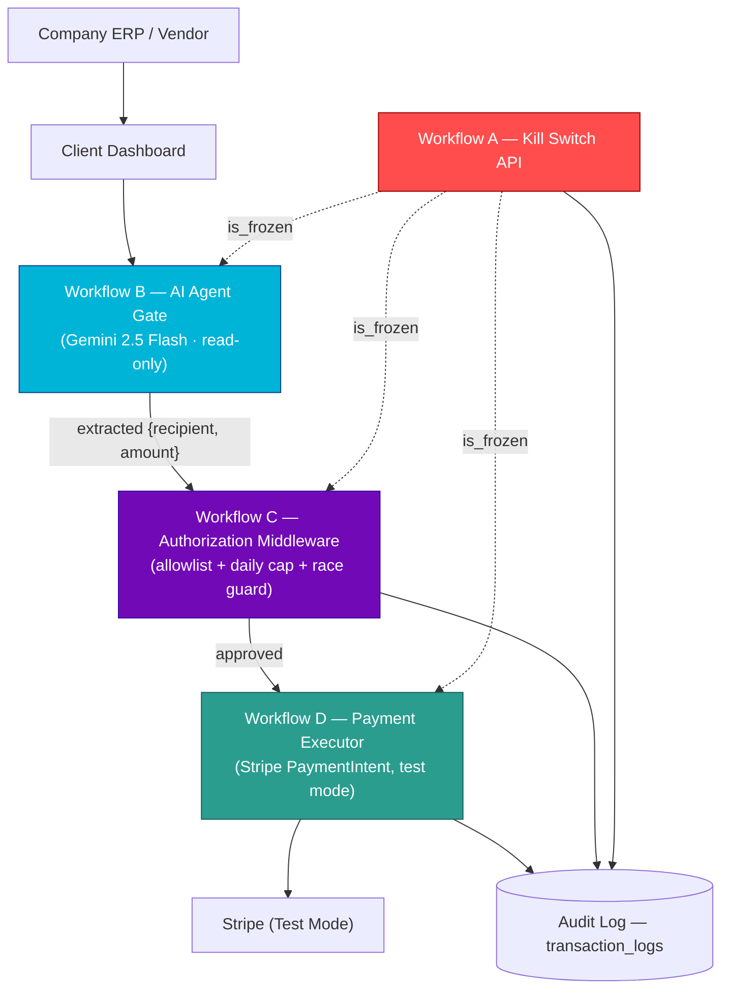

<picture><source media="(prefers-color-scheme: dark)" srcset="./Abhijit.png">
<source media="(prefers-color-scheme: light)" srcset="./Abhijit2.png">
</picture>

 

### AI-Driven Software Developer · SGRAMX Intern · Computer Engineer

 

  
  
  

  
  

  <strong>📍 PIMPRI, PUNE, MAHARASHTRA, INDIA</strong>

 

  <strong><em>“I’m not here to clone tutorials or collect green squares. 
  I find real problems, engineer real solutions, and ship them where they actually matter.”</em></strong>

 

## Tech Stack

<table>
<tr>
<th align="left">Category</th>
<th align="left">Technologies</th>
</tr>

<tr>
<td><strong>💻 Languages</strong></td>
<td>

</td>
</tr>

<tr>
<td><strong>🎨 Frontend</strong></td>
<td>

</td>
</tr>

<tr>
<td><strong>⚙️ Backend</strong></td>
<td>

</td>
</tr>

<tr>
<td><strong>🗄️ Database</strong></td>
<td>

</td>
</tr>

<tr>
<td><strong>📱 Mobile</strong></td>
<td>

</td>
</tr>

<tr>
<td><strong>🤖 AI & Automation</strong></td>
<td>

</td>
</tr>

<tr>
<td><strong>🛠️ Tools & Platforms</strong></td>
<td>

</td>
</tr>

</table>
 

---

## Project Stack

 

### CO-PO Attainment Calculation System 

A centralized academic automation platform for MSBTE diploma faculty across Maharashtra, supporting all subject types and evaluation schemes[cite: 1].

<h3>⚡ Key Features & Impact</h3>
<ul>
    <li><strong>Automated Workflows:</strong> Streamlines CO-PO attainment calculations and report generation, reducing manual effort by 95%[cite: 1].</li>
    <li><strong>Rapid Reporting:</strong> Generates accurate, audit-ready compliance reports in under 10 minutes[cite: 1].</li>
    <li><strong>Standards Aligned:</strong> Designed specifically to meet MSBTE and NBA-style outcome-based education standards[cite: 1].</li>
    <li><strong>Tech Stack:</strong> PHP, MySQL, HTML, CSS, JavaScript[cite: 1]</li>
</ul>

<h3>📸 Previews</h3>
<table>
<tr>
<td></td>
<td></td>
<td></td>
</tr>
</table>

<h3>🔗 Links</h3>

---

### 🛡️ PayPilot — AI-Powered, Zero-Trust Payment Authorization Middleware

**The problem it solves:** letting an AI agent *initiate* a payment is easy — letting it safely *authorize and execute* one is the part almost every "agentic payments" demo skips. PayPilot proves an AI agent can participate in a payment flow while structurally never being able to move money itself.

PayPilot is an independent, four-workflow middleware sitting between an AI agent and Stripe. The AI is only ever allowed to *read intent* — a separate, deterministic authorization layer is the only thing that can say yes, and an operator can kill the entire pipeline in one click, at any time.

**Key features**
- **Workflow A — Kill Switch API:** one webhook flips `is_frozen` and writes an immutable audit row for every freeze/unfreeze
- **Workflow B — AI Agent Gate:** Gemini 2.5 Flash extracts `{recipient, amount}` from a request — the AI has **zero database and zero Stripe access**
- **Workflow C — Authorization Middleware:** allowlist check, daily spending cap, and a race-guard re-check immediately before execution
- **Workflow D — Payment Executor:** the only workflow holding Stripe credentials; creates a real Stripe **PaymentIntent** in test mode
- Live dashboards: client invoice portal, admin control room (wallet limits, allowlist, circuit breaker), and a real-time n8n workflow visualizer

**Engineering highlights**
- `is_frozen` is re-checked at **5 separate checkpoints** across the request lifecycle — a true circuit breaker, not a single boolean gate
- The middleware **re-derives every fact from Postgres** on every call and never trusts caller-supplied state, closing the door on prompt-injection spoofing
- Audit trail reuses the existing `transaction_logs` table with sentinel values (`recipient='SYSTEM'`) instead of adding new schema
- Uses Stripe's **PaymentIntents API** (not legacy Charges) for realistic payment-status handling
- Built for a FinTech hackathon under an existing-schema constraint — every architectural decision is documented in the repo's `decisions.md` (9 ADRs)

**Tech stack:** Vite + React 18 · Tailwind CSS · Framer Motion · n8n Cloud · Google Gemini 2.5 Flash · Stripe (test mode) · Supabase Postgres

<table>
<tr>
<td></td>
<td></td>
</tr>
<tr>
<td></td>
<td></td>
</tr>
</table>

> ⚠️ *The PayPilot repo's own README currently lists `github.com/MeetRaval8983/PayPilot` as "the" GitHub repository — this was a team hackathon build. The link above points to your own copy of the repo.*

 

---

### 🛒 Electromart — Sponsored by KT Electricals

**The problem it solves:** a local electronics & electrical-equipment retailer needed a real online storefront — not a static catalog, but a system with accounts, inventory, order tracking, and moderation.

A comprehensive, responsive Indian e-commerce application for electronics and electrical equipment, with a full admin panel and invoice system, backed by Supabase.

**Key features**
- Role-based accounts (`user` / `admin`) with account-level banning
- Product catalog with structured specs, multiple images, ratings, and reviews
- Cart, favorites/wishlist, and a full saved-address book
- Order lifecycle tracked through explicit states: `Placed → Accepted → Shipped → Delivered / Cancelled`
- Admin dashboard covering products, orders, users, reviews, and a feedback/complaints inbox

**Engineering highlights**
- Fully typed domain model (`Product`, `Order`, `OrderItem`, `Review`, `Favorite`, `Address`, `Profile`) in `types/database.ts`
- Order-status state machine drives both the customer order-tracking view and the admin orders console
- Dedicated admin surfaces for moderation: `AdminUsers` (ban/unban), `AdminReviews`, `AdminFeedback`, `AdminProducts`

**Tech stack:** React 19 · TypeScript · Vite · Tailwind CSS · React Router v7 · Supabase (Auth + Postgres) · lucide-react

<table>
<tr>
<td></td>
<td></td>
</tr>
<tr>
<td></td>
<td></td>
</tr>
</table>

 

---

### 🎓 Campus Cart — Second-Hand Buying & Selling Platform for Students

**The problem it solves:** students had no dedicated, trustworthy channel to buy and sell books, gadgets, and daily-use items within their own college — so they were stuck using unsafe, unrelated external platforms.

A campus-focused marketplace with real-time buyer–seller chat and admin moderation, built around a clear 6-step workflow: **Registration → Product Listing → Discovery → Communication → Purchase → Admin Management.**

**Key features**
- Secure registration, login, and session-based authentication
- Product listings with images, search, and filtering
- Integrated **WhatsApp-style real-time chat** between buyer and seller for negotiation
- Admin dashboard for listing moderation, transaction monitoring, and CSV export
- Password hashing, SQL-injection protection, and secure file-upload validation

**Tech stack:** PHP 8+ · MySQL 8.0 · HTML5 · CSS3 · JavaScript · Apache/XAMPP

<table>
<tr>
<td></td>
<td></td>
</tr>
<tr>
<td></td>
<td></td>
</tr>
</table>

> ⚠️ *The Campus Cart repo lists its live site as `campuscart.page.gd` — double-check whether `campuscart.rf.gd` (used above, as you specified) and `.page.gd` are the same deployment before publishing.*

 

---

### 🌸 Pushpa — The Indian Flower Market

**The problem it solves:** connecting customers, independent florists, and platform admins in one system, instead of florists each running their own ad-hoc sales process.

A role-based flower-selling and management platform with AI-assisted product content, built on the same modern stack as Electromart and Yatra AI.

**Key features**
- Multi-role access: **User, Florist, Admin**
- Product listing and order-management workflows for florists
- Clean, mobile-first, responsive UI
- Structured for future integrations — payments and delivery tracking are the explicit next steps

**Tech stack:** React 19 · TypeScript · Vite · Supabase · Google Gemini API (`@google/genai`) · lucide-react

<table>
<tr>
<td></td>
<td></td>
</tr>
<tr>
<td></td>
<td></td>
</tr>
</table>

 

---

### 📊 SPPU Result Analysis Automation System

**The problem it solves:** turning an official SPPU ledger PDF into a full batch result-analysis report used to take **2–3 days** of manual spreadsheet work every semester.

An academic automation tool that parses SPPU ledger PDFs directly into structured, ready-to-share Excel reports.

**Key features**
- Automated extraction of student records straight from the SPPU ledger PDF
- Auto-generated pass percentages, subject-wise analysis, topper lists, and performance summaries
- Visual dashboards and Excel-based analysis sheets, generated without manual formatting
- Eliminates repetitive manual calculation and the human error that comes with it

**Reported impact** *(as stated in the project's own documentation)*: report preparation time cut from 2–3 days to **under 10 seconds**.

**Tech stack:** Python · pdfplumber · Pandas · OpenPyXL · Excel Automation · Data Visualization

<table>
<tr>
<td></td>
<td></td>
</tr>
<tr>
<td></td>
<td></td>
</tr>
</table>

📌 Replace `ADD_YOUR_GOOGLE_DRIVE_OUTPUT_LINK_HERE` with your Drive output-folder link before publishing.

 

---

### ⛓️ Web3Quest — Blockchain Learning Platform

**The problem it solves:** most people learn blockchain concepts through dense theory instead of hands-on practice — Web3Quest replaces the theory-first approach with gamified, task-based learning.

A gamified Web3 learning platform teaching blockchain concepts through interactive challenges, quizzes, contests, and badges.

**Key features**
- Learn-by-doing: hands-on tasks instead of traditional theory modules
- Gamified experience with rewards, badges, leaderboards, and contests
- Interactive quizzes and practical Web3 activities to drive engagement
- Progress tracking to encourage continuous learning

**Tech stack:** React · TypeScript · Supabase · Web3

<table>
<tr>
<td></td>
<td></td>
</tr>
<tr>
<td></td>
<td></td>
</tr>
</table>

 

---

### 🤖 Yatra AI — Your Smart Travel Partner

**The problem it solves:** planning a trip usually means hours of manual research across interests, budget, and location — Yatra AI delegates that research to an LLM and hands back a ready itinerary.

A full-scale, AI-first tourism recommendation platform where nearly all intelligence is delegated to a large language model.

**Key features**
- AI-driven destination recommendations based on interests, budget, location, trip length, and group type — with reasoning
- Dynamic day-wise itinerary generation (morning / afternoon / evening activities, with travel tips)
- Review summarization: aggregates crowdsourced feedback into a single "Verdict" paragraph
- Role-based access (User / Admin) on a Supabase-ready structure
- Interactive geospatial maps for destination exploration

**Engineering highlights**
- Intelligence engine powered by the **Google Gemini API** (`gemini-3-flash-preview`)
- Supabase Postgres with **Row-Level Security (RLS)** policies for data access control
- High-end Tailwind CSS design system tuned for both mobile and desktop

**Tech stack:** React 18+ · TypeScript · Tailwind CSS · Supabase (Postgres + RLS) · Google Gemini API

<table>
<tr>
<td></td>
<td></td>
</tr>
<tr>
<td></td>
<td></td>
</tr>
</table>

 

---

### 🧽 Scrubbers Sales & Expense Management System

**The problem it solves:** built for my father's stainless-steel scrubber manufacturing business (Siddhanath Scrubbers) — replacing manual, paper-based bookkeeping with a real financial system.

A full-stack sales, expense, and profit-analytics system used to track a real small manufacturing business day to day.

**Key features**
- Add / update / delete sales entries with auto price-per-sheet calculation
- Expense tracking (petrol, transport, packaging, other) with descriptions
- Financial summaries across Daily / Weekly / Monthly / Yearly / All-Time views
- Documented REST API (`/api/sales`, `/api/expenses`, `/api/transactions`, `/api/summary`)

**Engineering highlights**
- MongoDB **aggregation pipeline** powers the period-based revenue/expense/profit summaries
- Profit logic runs on a real, verified production-cost constant: **₹43 per sheet**
- Formula: `Net Profit = Total Revenue − Production Cost − Total Expenses`, with profit margin computed as `(Net Profit / Total Revenue) × 100`
- Deployed and actively usable in production on Render

**Tech stack:** Node.js · Express.js · MongoDB Atlas · Mongoose · HTML/CSS/JS · Render

<table>
<tr>
<td></td>
<td></td>
<td></td>
</tr>
</table>

 

---

## System Architecture — PayPilot (Flagship Project)

`is_frozen` is re-checked at every irreversible boundary — before the LLM call, before authorization, immediately before execution, and before any retry — so an Emergency Stop halts both new requests and payments already mid-flight.

 

---

## Experience

**AI-Driven Software Developer Intern — SGRAMX** *(current)*

**Android Development Intern — Swara Infotech, Islampur** · *June 2024 – July 2024*
- Developed Android applications with Firebase integration
- Improved UI/UX and optimized application performance
- Debugged and enhanced features under senior developer mentorship

**Member Lead — GDG DIT (Google Developer Group, Dr. D. Y. Patil Institute of Technology)**
- Active member of the App Development and Web Development teams
- Collaborated on development tasks, peer learning, and technical discussions
- Participated in workshops, coding sessions, and tech events organized by GDG

 

## Education

| Degree | Institute | Result |
|---|---|---|
| B.E. Computer Engineering | Dr. D. Y. Patil Institute of Technology, Pimpri | **CGPA 9.27** |
| Diploma in Computer Engineering | Rajarambapu Institute of Technology, Islampur | **92.91%** |

 

## Leadership & Activities

- 👑 **Student President** — Computer Engineering Students Association *(2023–2024)*
- Organized technical events, workshops, and coding competitions
- Member of the Library & Discipline Committees

 

## Currently Exploring

- Advanced **Python** for AI, Data Science, and DSA
- Building **AI-powered web applications**
- **Agentic AI systems** and intelligent automation
- System design principles for **scalable architectures**

 

---

### Let's build something.

⭐ Thanks for visiting — feel free to explore the projects above, they're all live.

